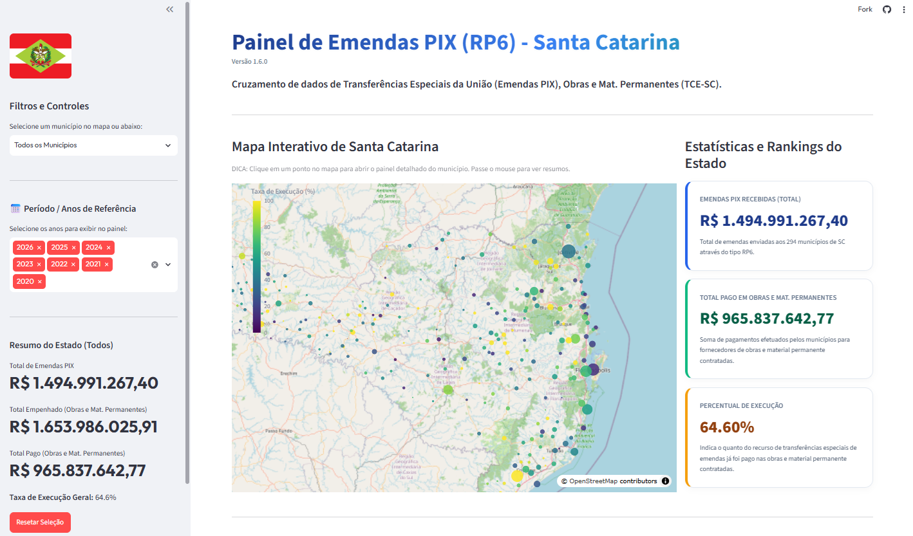
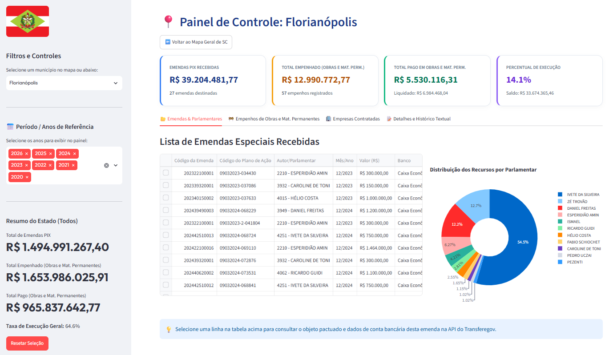
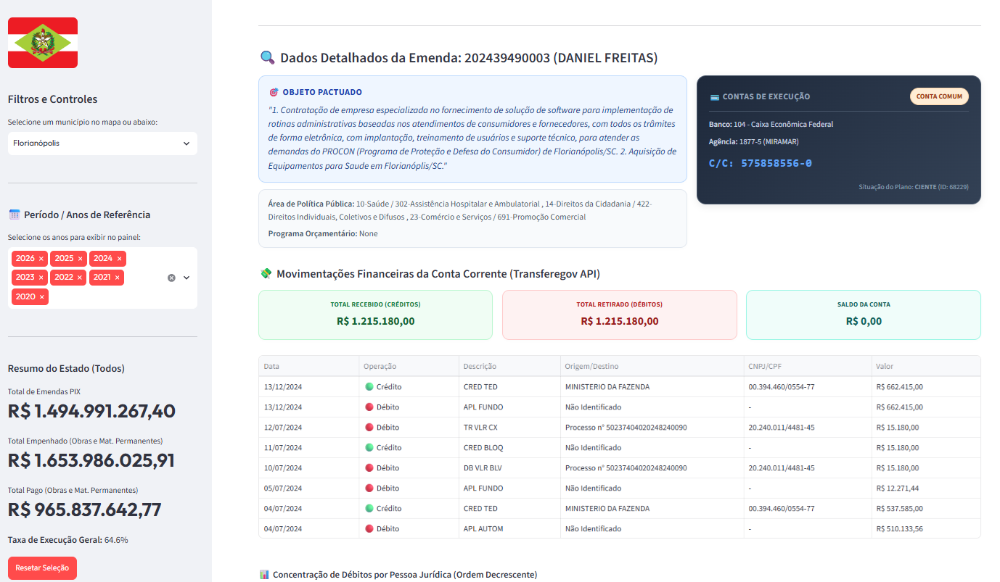
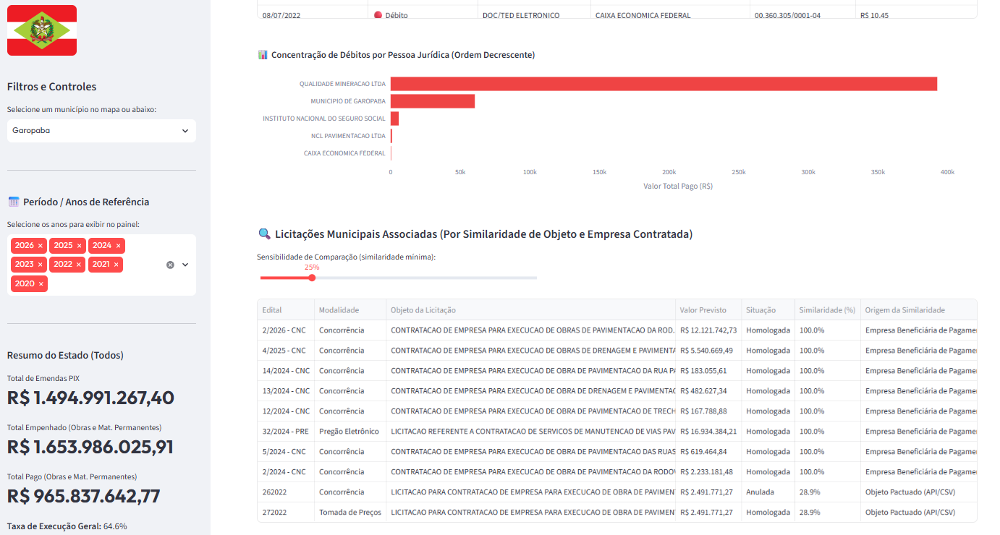
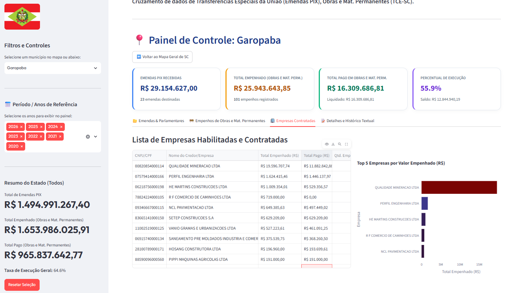
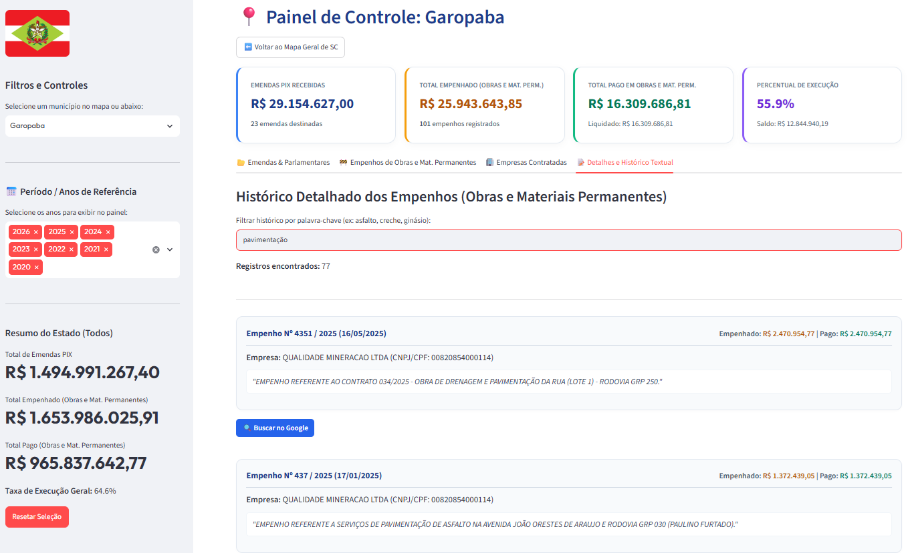

# Painel Interativo de Emendas Parlamentares, Obras e Materiais Permanentes em Santa Catarina (Emendas PIX)

Este é um painel interativo e analítico, desenvolvido em Python com a biblioteca **Streamlit**, projetado para monitorar e ajudar na fiscalização da destinação e da execução física/financeira de recursos públicos federais provenientes de **Transferências Especiais da União (RP6 / Emendas PIX)** destinadas aos municípios do estado de Santa Catarina.

A aplicação cruza dados de repasses orçamentários, históricos de empenhos municipais para obras e materiais permanentes, licitações municipais enviadas ao Tribunal de Contas do Estado de Santa Catarina (TCE-SC), e consultas com apuração de extratos e contas correntes na base oficial de dados do governo federal (Transferegov).

Acesse a versão atual do **Painel de Emendas PIX - Santa Catarina** em [https://painel-emendas-pix-sc.streamlit.app](https://painel-emendas-pix-sc.streamlit.app).

<div>
<p align="center">
  
</p>
</div>

---

## 🎯 Utilidade e Objetivo

O painel visa aprimorar a transparência pública, permitindo que cidadãos, gestores municipais e órgãos de controle social e fiscalização (como o TCE-SC, TCU, CGU e Ministério Público):

- **Visualizem a distribuição espacial** dos recursos de emendas federais por meio de mapas interativos de Santa Catarina.
- **Monitorem a eficiência de conversão financeira** (relação entre o que foi empenhado/liquidado/pago nas prefeituras e os recursos PIX disponibilizados).
- **Verifiquem o destino exato de cada pagamento** feito por meio das contas específicas do governo federal, identificando fornecedores contratados e extratos de contas correntes.
- **Auditem empresas e fornecedores contratados** com visão estadual consolidada, analisando raio de ação geográfico, concentração/dependência política por parlamentar e divergências entre a contabilidade do TCE-SC e saídas bancárias reais.

---

## ⚡ Principais Funcionalidades

1. **Dois Modos Integrados de Análise (Sidebar)**:
   - **📍 Visão por Município**: Permite navegar pelos 294 municípios catarinenses, inspecionando emendas recebidas, empenhos de obras, licitações e empresas contratadas localmente.
   - **🏢 Visão por Empresa**: Permite pesquisar qualquer fornecedor/empresa contratada em SC, com panorama geral estadual e Raio-X individual da empresa selecionada.
2. **Mapa de Distribuição Geográfica de Recursos**:
   Apresentação espacial de Santa Catarina com pontos georreferenciados para cada município beneficiário. O tamanho do círculo indica o volume financeiro recebido e a cor representa a eficiência de pagamento orçamentário.
3. **Raio de Ação Geográfico da Empresa**:
   Mapa interativo exclusivo da empresa selecionada, destacando no mapa do estado apenas as cidades onde ela atuou ou recebeu pagamentos de emendas PIX.
4. **Auditoria Cruzada (TCE-SC vs Transferegov)**:
   Comparativo direto entre o que as prefeituras registraram nos portais contábeis do TCE-SC e os valores reais debitados da conta bancária da emenda no Transferegov, apontando status de conciliação financeira e eventuais divergências.
5. **Análise de Dependência / Concentração Política**:
   Cálculo automático do percentual de faturamento da empresa originado por cada parlamentar autor de emenda, classificando o fornecedor em faixas de concentração (alta, moderada ou recursos diversificados).
6. **Filtro de Período (Multiselect)**:
   Barra lateral de controles com suporte para filtragem múltipla de anos (2022 a 2026), recalculando instantaneamente todos os gráficos, resumos estaduais, mapas e tabelas da interface.
7. **Mecanismo de Similaridade Combinada com Ponderação Geográfica**:
   - Algoritmo de Jaccard Ponderado que realiza buscas de licitações municipais cadastradas que guardam similaridade com o objeto da emenda do Transferegov ou com o histórico de empenhos vinculados.
   - **Location Weight Boosting**: Palavras indicativas de vias públicas ou bairros (como nomes de ruas, avenidas, rodovias ou linhas) recebem peso extra ($4.0$) para evitar correspondências genéricas e focar na localização exata das intervenções urbanas.
8. **Sincronização e Atualização Automática de Pagamentos**:
   Verificação de novas contas correntes e emendas diretamente na API do Transferegov e cache inteligente com validade de 30 dias.

---

## 🧭 Navegação no Painel

O painel oferece dois modos de navegação na barra lateral esquerda:

### 📍 1. Visão por Município

Ao selecionar **"📍 Visão por Município"**, o painel organiza a análise local através de 4 abas especializadas:

#### Aba 1: 📂 Emendas & Parlamentares

<div>
<p align="center">
  
</p>
</div>

- Listagem de emendas parlamentares do município selecionado, o parlamentar autor do envio e os montantes correspondentes.
- Integração com a API do governo federal apresentando o **Objeto Pactuado (API)** e dados de **Contas de Execução**.
- Consulta de **Lançamentos Financeiros (Extrato)** com cartões consolidados de crédito/débito e gráfico analítico de pagamentos a PJs.

<div>
<p align="center">
  
</p>
</div>

- Tabela de **Licitações Municipais Associadas** por similaridade textual e ponderação geográfica.

<div>
<p align="center">
  
</p>
</div>

#### Aba 2: 🚧 Empenhos de Obras e Mat. Permanentes

- Tabela com os empenhos emitidos pela prefeitura vinculados a recursos de transferências especiais da União.
- Estruturação completa: número da licitação, código do contrato, datas, credor fornecedor e valores de empenho, liquidação e pagamento.
- Histórico textual detalhado do empenho para auditoria e fiscalização.

#### Aba 3: 🏢 Empresas Contratadas

<div>
<p align="center">
  
</p>
</div>

- **Lista de Empresas Habilitadas e Contratadas (TCE-SC)**: Total empenhado, liquidado e pago, com documentos (CNPJ/CPF) padronizados e quantidade de processos.
- **Pagamentos às Empresas (Extratos Bancários - Transferegov)**: Saídas reais debitadas da conta corrente da emenda com ranking das Top 5 empresas beneficiárias no município.

#### Aba 4: 📝 Detalhes e Histórico Textual

- Pesquisa textual rápida de empenhos e credores por palavras-chave (ex.: asfalto, creche, reforma).
- Cartões com valor empenhado e pago, busca direta no Google e links externos para portais de transparência.

<div>
<p align="center">
  
</p>
</div>

---

### 🏢 2. Visão por Empresa / Fornecedor

Ao selecionar **"🏢 Visão por Empresa"** no menu lateral, o painel se transforma em uma plataforma de inteligência e cruzamento fiscal focado nas pessoas jurídicas contratadas:

#### Panorama Geral de Fornecedores (Nenhuma empresa selecionada)

- **Top 15 Fornecedores de SC**: Gráfico comparativo das empresas com maior volume pago em Santa Catarina via extratos do Transferegov.
- **Estatísticas Consolidadas**: Total de fornecedores identificados, volume total pago em extratos, volume empenhado no TCE e maior fornecedor do estado (por total pago via Transferegov).
- **Tabela Geral de Fornecedores**: Mais de 3.400 empresas catalogadas com CNPJ/CPF formatado, valores pagos via Transferegov (extratos bancários), valores empenhados e valores pagos no TCE-SC.

#### Raio-X Completo da Empresa Selecionada

Ao selecionar uma empresa específica no seletor da barra lateral:

- **Layout Integrado [7:3]**:
  - **Lado Esquerdo (70%)**: **Mapa do Raio de Ação Geográfico** destacando exclusivamente os municípios onde a empresa prestou serviços ou recebeu pagamentos de emendas PIX.
  - **Lado Direito (30%)**: **Indicadores da Empresa** com total recebido em conta bancária (Transferegov), total empenhado no TCE-SC, quantidade de prefeituras contratantes e processos de empenho registrados.
- **4 Abas Analíticas**:
  1. **📍 Presença Geográfica**: Gráfico de distribuição do volume financeiro por município e tabela detalhada de contratações por prefeitura.
  2. **🏛️ Origem Parlamentar**: Diagnóstico de dependência política com indicador de concentração (Alta, Moderada ou Diversificada), gráfico de participação de cada parlamentar e tabela de pagamentos por emenda e plano de ação.
  3. **⚖️ Auditoria: TCE-SC vs Transferegov**: Gráfico de barras agrupadas comparando _Empenhado (TCE)_ vs _Pago Contábil (TCE)_ vs _Debitado em Conta (Transferegov)_, além de tabela de conciliação apontando divergências e status de alinhamento.
  4. **📝 Obras e Contratos Detalhados**: Listagem de todos os processos de empenho, editais de licitação, números de contrato e descrições de objetos registrados para a empresa no TCE-SC.

---

## 🛠️ Estrutura do Projeto

```
painel-emendas/
├── dados/
│   ├── emendas_sc.csv                                                  # Cadastro de emendas RP6 recebidas com dados bancários
│   ├── pagamentos_pj.csv                                               # Base consolidada de pagamentos efetuados a PJs (extratos)
│   ├── TCE_empenhos_obras_mat_permanentes_tranferencias_especiais.xlsx # Empenhos de obras e materiais permanentes de SC
│   ├── TCE_licitacoes_obras.xlsx                                       # Cadastro de licitações de obras de SC
│   └── municipios_sc.csv                                               # Coordenadas geográficas dos municípios de SC
├── app.py                                              # Aplicação principal Streamlit
├── atualizar_pagamentos_pj.py                           # Script de coleta e sincronização com a API Transferegov
├── requirements.txt                                    # Dependências Python do projeto
├── CHANGELOG.md                                        # Histórico detalhado de versões
├── LICENSE                                             # Licença de uso (MIT)
└── README.md                                           # Documentação oficial
```

---

## ⚙️ Requisitos e Instalação

### Requisitos Mínimos

- **Python 3.9 ou superior** instalado.
- Conexão ativa com a internet (para chamadas à API do Transferegov e carregamento de mapas).

### Instalação de Dependências

No console de comando (Terminal/PowerShell), clone este repositório ou navegue até a pasta do projeto e instale as bibliotecas requeridas executando:

```bash
pip install -r requirements.txt
```

As principais bibliotecas utilizadas são:

- `streamlit`: Framework para a interface web interativa.
- `pandas`: Processamento de dados e manipulação de DataFrames.
- `openpyxl`: Suporte para leitura de planilhas Excel (`.xlsx`).
- `plotly`: Gráficos interativos e mapas de dispersão georreferenciados.
- `requests`: Comunicação HTTP com a API do Transferegov.

---

## 🚀 Como Executar

### 1. Iniciar o Painel Interativo

Para rodar a aplicação localmente no navegador:

```bash
streamlit run app.py
```

O painel será aberto automaticamente no endereço: [http://localhost:8501](http://localhost:8501).

### 2. Sincronizar Base de Pagamentos (Opcional)

Para atualizar a base local `dados/pagamentos_pj.csv` com novos lançamentos de extrato e novas emendas da API do Transferegov:

```bash
# Execução padrão (utiliza cache com validade de 30 dias):
python atualizar_pagamentos_pj.py

# Personalizar o período de expiração do cache (ex: 15 dias):
python atualizar_pagamentos_pj.py --dias-expiracao 15

# Forçar atualização completa ignorando o cache existente:
python atualizar_pagamentos_pj.py --forcar
```

---

## 📊 Fontes de Dados

- **Emendas Parlamentares RP6**: Portal de Dados Abertos do Transferegov (Ministério da Gestão e da Inovação em Serviços Públicos).
- **Pagamentos a Pessoas Jurídicas (Extratos)**: Base consolidada de pagamentos de transferências especiais da União a credores PJ (`pagamentos_pj.csv`), extraída das contas correntes oficiais da API do Transferegov.
- **Empenhos de Obras e Materiais Permanentes (TCE-SC)**: Planilha `TCE_empenhos_obras_mat_permanentes_tranferencias_especiais.xlsx` extraída do **Portal Farol do TCE-SC**. Contém todos os empenhos dos municípios catarinenses que tiveram como fonte de recursos as Transferências Especiais da União (Emendas PIX) e foram aplicados em obras ou materiais permanentes.
- **Licitações Municipais de Santa Catarina**: Portal de Contas Públicas do Tribunal de Contas do Estado de Santa Catarina (TCE-SC).
- **Coordenadas dos Municípios**: Diretoria de Geociências do Instituto Brasileiro de Geografia e Estatística (IBGE).

---

## ✍️ Autoria e Contato

- Desenvolvido por **Orlando Castro** com auxílio de IAs.
- Licenciado sob a **Licença MIT**. Para dúvidas, sugestões ou colaborações, entre em contato através dos canais do repositório.
